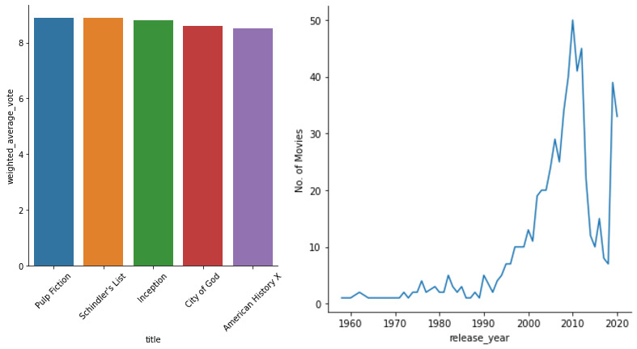

# Portfolio
---

## Netflix Movies EDA using Pandas and Seaborn

Using the dataset of IMDb and Netflix movies, I can find the top movies that can be found on Netflix using the user ratings that can be found in the IMDb dataset. By merging the dataset I was able to perform EDA using pandas and seaborn. 

 

 

© Arif Zafri. Powered by Jekyll and the Minimal Theme.

